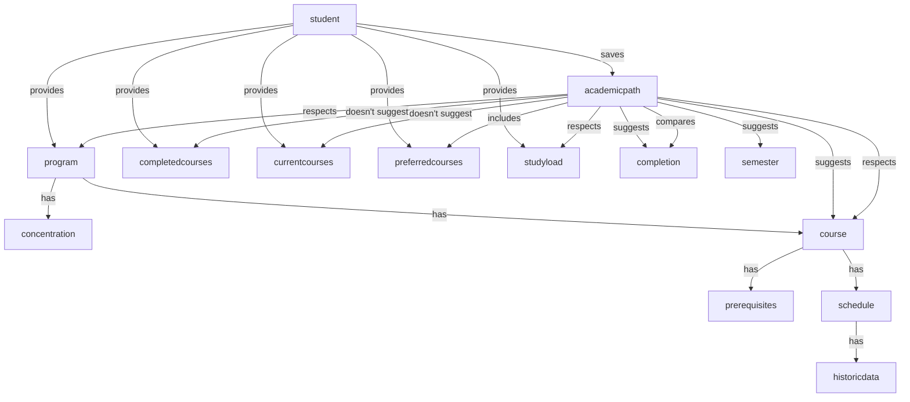

# Object-Oriented Design

## Conceptual Model

Nouns in [Use Cases](use-cases.md):

- student
- ~~study load~~
- preferences
- concentration
- course
- completed courses
- program
- academic path
- prerequisites
- schedule
- completion
- semester
- comparison
- historic data
- ~~assumptions~~
- reference plan → saved plan
- constraints
- ~~delay causes~~
- explanation
- timeline

Verbs in [Use Cases](use-cases.md):

- provides preferences
- retrieves program structure and required courses
- generates academic paths
- respects constraints
  - includes all required courses
  - includes preferred courses
  - respectes prerequisites and schedules
  - accounts for courses in progress
- aims to minimize the number of semesters required
- displays suggested path
- evaluates each path
- ranks or score paths
- updates preferences
- recalculates
- updates comparison
- have no available schedule
- checks historic data
- makes assumptions
- fill gaps
- notifies
- selects academic path
- saves academic path
- access saved plan
- track progress
- selects specific courses
- identifies and highligts the main causes
- display a clear explanation
- suggests ways to reduce timeline

> Need to avoid god class with academic path and student

## Class Diagrams

|            | Student                  |
| ---------- | ------------------------ |
| Attributes | program: Program         |
| Attributes | constraints: Constraints |
| Attributes | savedPath: Path          |
| Behaviors  | setProgram               |
| Behaviors  | setConstraints           |
| Behaviors  | savePath                 |

|            | Program                        |
| ---------- | ------------------------------ |
| Attributes | name: string                   |
| Attributes | url: string                    |
| Attributes | concentration                  |
| Attributes | mandatoryCourses: List[Course] |
| Attributes | electiveCourses: List[Course]  |
| Behaviors  | setConcentration               |
| Behaviors  | fetchCourses                   |

|            | Course                       |
| ---------- | ---------------------------- |
| Attributes | name: string                 |
| Attributes | code: string                 |
| Attributes | url: string                  |
| Attributes | prerequisites: List[Course]  |
| Attributes | schedule: Shedule            |
| Attributes | historicData: List[Schedule] |
| Behaviors  | fetchPrerequisites           |
| Behaviors  | fetchHistoricData            |
| Behaviors  | fetchSchedule                |
| Behaviors  | predictSchedule              |

|            | Semester                         |
| ---------- | -------------------------------- |
| Attributes | semester: Fall, Winter or Summer |
| Attributes | year: int                        |
| Attributes | startDate:                       |
| Attributes | endDate:                         |
| Attributes | courses: List[Course]            |
| Behaviors  | addCourse(Course)                |
| Behaviors  | removeCourse(Course)             |

|            | Schedule                      |
| ---------- | ----------------------------- |
| Attributes | semester: Semester            |
| Attributes | sessions: List[CourseSession] |

|            | CourseSession                 |
| ---------- | ----------------------------- |
| Attributes | day: string                   |
| Attributes | typeOfSession: Lecture or Lab |
| Attributes | startTime:                    |
| Attributes | endTime:                      |

|            | Constraints                    |
| ---------- | ------------------------------ |
| Attributes | nbCoursesPerSemester: int      |
| Attributes | completedCourses: List[Course] |
| Attributes | currentCourses: List[Course]   |
| Attributes | preferredCourses: List[Course] |
| Behaviors  | setStudyLoad                   |
| Behaviors  | setCompletedCourses            |
| Behaviors  | setCurrentCourses              |
| Behaviors  | setPreferredCourses            |

|            | Path                       |
| ---------- | -------------------------- |
| Attributes | structure: List[Semester]  |
| Attributes | lastSemester: List[Course] |

|            | PathEvaluator                   |
| ---------- | ------------------------------- |
| Attributes | validPath: bool                 |
| Attributes | score: int                      |
| Attributes | pathRecommendation: string      |
| Behaviors  | checkScheduleConflict(Semester) |
| Behaviors  | checkScheduleAvailability       |
| Behaviors  | validateStudyLoad               |
| Behaviors  | evaluateScore                   |
| Behaviors  | summarizeRecommendations        |

|            | PathPlanner                |
| ---------- | -------------------------- |
| Attributes | path: Path                 |
| Behaviors  | determineCoursesToDo       |
| Behaviors  | setCourseWithPrerequisites |
| Behaviors  | setMandatoryCourses        |
| Behaviors  | selectPreferredCourses     |

_to be continued and improved, good starting point to start to code_
